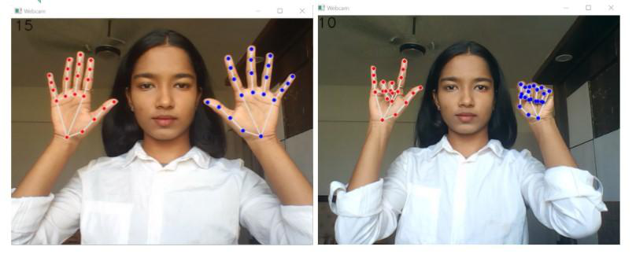
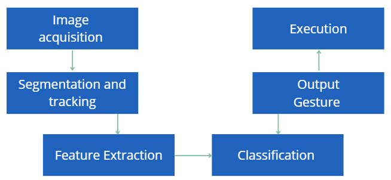
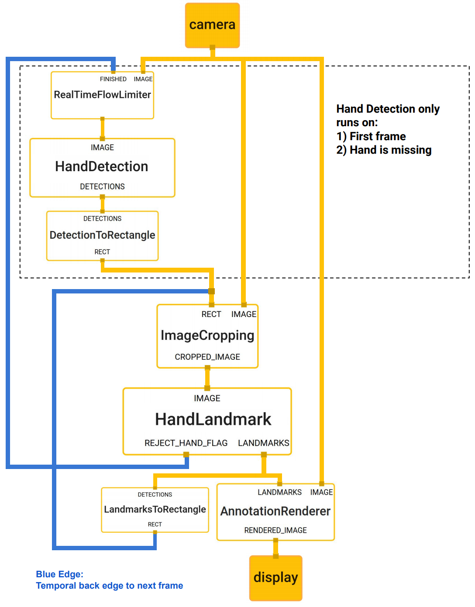

---

# Air Whiteboard

This project is a hand gesture-based drawing application that allows users to draw on a canvas using their hands. It utilizes the **MediaPipe** library for hand tracking, detecting finger positions and gestures in real-time. The user can interact with the application by selecting different brush colors and drawing on a digital canvas using their hand movements.

## Features

- **Hand Gesture Recognition**: Uses the MediaPipe hand tracking model to detect hand landmarks and finger positions.
- **Brush Selection**: Users can select different brush colors by performing specific hand gestures (index and middle fingers up).
- **Drawing and Erasing**: Draw on a canvas using the index finger, with the option to erase by selecting the black color (eraser mode).
- **Canvas**: Drawings are captured on a canvas and displayed in real-time.
  
## Requirements

- Python 3.x
- OpenCV
- NumPy
- MediaPipe (for hand tracking)

## Installation

To get started, clone this repository and install the required dependencies.

### Step 1: Clone the repository

```bash
git clone https://github.com/yourusername/hand-gesture-drawing.git
cd hand-gesture-drawing
```

### Step 2: Install dependencies

Create a virtual environment (optional but recommended) and install the required packages.

```bash
python -m venv venv
source venv/bin/activate  # On Windows, use venv\Scripts\activate
pip install -r requirements.txt
```

If you don't have a `requirements.txt` file, you can manually install the dependencies:

```bash
pip install opencv-python numpy mediapipe
```

### Step 3: Add Header Images

Make sure you have a folder named `Header` in the project directory containing images that will be used for color selection. These images are used as buttons to select different brush colors. You should have at least 4 images for this purpose:

1. Purple brush
2. White brush
3. Green brush
4. Black brush (for eraser)

Place these images inside the `Header` folder and name them appropriately (e.g., `brush1.png`, `brush2.png`, etc.).

### Step 4: Run the Application

Once you've installed the necessary dependencies and added the required images, you can start the application by running the script:

```bash
python main.py
```

The application will open a window displaying the webcam feed, with the top portion used for selecting the brush colors and the bottom for drawing. Use hand gestures to interact with the app:

- **Drawing Mode**: Raise your index finger to start drawing.
- **Selection Mode**: Raise both the index and middle fingers to enter selection mode, where you can select different brush colors by pointing to the top of the screen.




## How It Works

1. **Hand Tracking**: The application uses **MediaPipe's** hand tracking model to detect hand landmarks and finger positions. It processes the video feed from the webcam and identifies key hand landmarks (e.g., index, middle, and thumb tips).
2. **Gesture Detection**: The user can enter "drawing mode" by raising the index finger or "selection mode" by raising both the index and middle fingers.
3. **Drawing**: In drawing mode, the application will draw lines based on the movement of the index finger. The user can also erase by selecting the black color (eraser mode).
4. **Canvas**: The canvas (`imgCanvas`) stores the drawing, while the webcam feed (`img`) displays the live camera feed.
5. **Brush Selection**: The user can select different brush colors by pointing to the top region of the screen (where header images are displayed). Each header image represents a different brush color.

   


### The `HandTrackingM` Module

The `HandTrackingM` module utilizes **MediaPipe** for hand tracking and provides the following functionality:

- **findHands(img)**: Processes the input image to detect hands. It draws hand landmarks on the image if `draw=True`.
- **findPosition(img, handNo=0)**: Retrieves the positions of the landmarks of the detected hand(s). The positions are returned as a list of coordinates for each landmark.
- **fingersUp()**: Determines which fingers are up (open) and which are down (closed). This is used to detect gestures, such as selecting the drawing tool or entering drawing mode.

#### MediaPipe Hand Tracking

- The `mediapipe` library's hand tracking solution provides an accurate and efficient method for detecting and tracking hands. It uses a deep learning model trained to detect hand landmarks (21 key points per hand), allowing for gesture recognition in real-time.

- This is how MediaPipe works


  
## Usage

- **Drawing**: Point with the index finger to draw on the screen.
- **Erase**: Select the black brush (eraser mode) to erase any drawings.
- **Change Brush**: Raise both the index and middle fingers, then point to one of the header images to select a different brush color.

## Troubleshooting

- **Hand Not Detected**: If the hand is not detected properly, make sure your hand is in front of the camera and clearly visible. You may need to adjust the lighting or the position of the hand.
- **Lag or Slow Performance**: If you experience lag or slow performance, try lowering the webcam resolution in the `cv2.VideoCapture()` settings.
